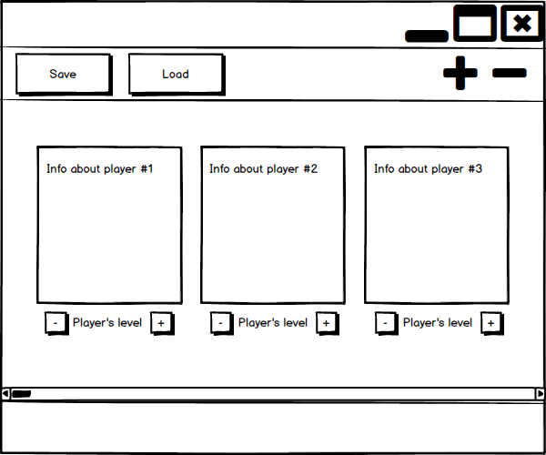
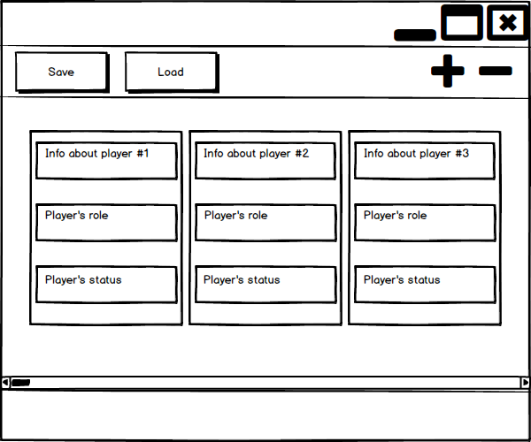
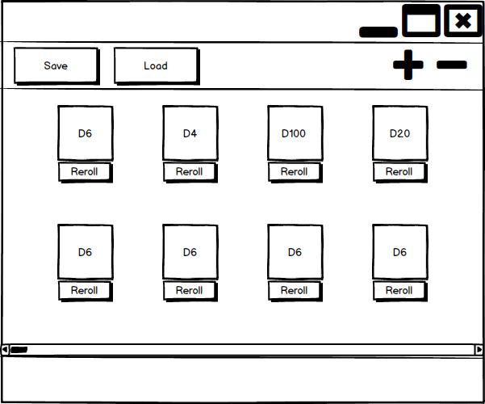
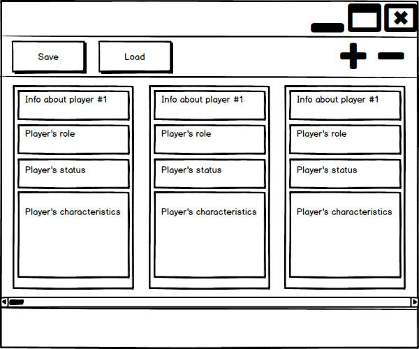

# Project requirements
---

# Content
1 [Introduction](#intro)  
1.1 [Purpose](#appointment)  
1.2 [Business requirements](#business_requirements)  
1.2.1 [Initital data](#initial_data)  
1.2.2 [Business opportunities](#business_opportunities)  
1.2.3 [Project boundary](#project_boundary)  
1.3 [Analogues](#analogues)  
2 [User requirements](#user_requirements)  
2.1 [Software interfaces](#software_interfaces)  
2.2 [User interface](#user_interface)  
2.3 [User specifications](#user_specifications)  
2.3.1 [Application audience](#application_audience)   
2.4 [Assumptions and dependencies](#assumptions_and_dependencies)  
3 [System requirements](#system_requirements)  
3.1 [Functional requirements](#functional_requirements)  
3.1.1 [Main functions](#main_functions)   
3.1.1.1 [Game choosing](#game_choosing)  
3.1.1.1.1 ["Munchkin" window](#munchkin)  
3.1.1.1.2 ["Mafia" window](#mafia)  
3.1.1.1.3 ["Dungeon&Dragons" window](#dungeons_and_dragons)  
3.1.1.1.4 ["Warhammer" window](#warhammer)  
3.1.1.2 [Save and load](#save_and_load)  
3.1.1.3 [Note](#note)  
3.2 [Non-functional requirements](#non-functional_requirements)  
3.2.1 [Quality attributes](#quality_attributes)  
3.2.1.1 [Ease of use requirements](#requirements_for_ease_of_use)  
3.2.1.2 [Security requirements](#security_requirements)  
3.2.2 [Restrictions](#restrictions)  

<a name="intro"/>

# 1 Introduction

<a name="appointment"/>

## 1.1 Purpose
Functional and non-functional requirements describe for Windows application "Boardgame Master".

<a name="business_requirements"/>

## 1.2 Business requirements

<a name="initial_data"/>

### 1.2.1 Initial data
There are millions of people playing the boardgames in the world. Many boardgames require a gamemaster. The most popular gamemaster's tools are paper and a pen. It's reather comfortable but there are troubles with saving and noting game progress. "Boardgame master" will make this process easier.

<a name="business_opportunities"/>

### 1.2.2 Business opportunities
The raising boardgames popularity causes the increasing of boardgame clubs and game masters amount. There are few problems with game sessions conduction: counting points and characteristics, noting information about players and their characters, saving the game state and loading the last saving game. Game masters are interested in making this processes easier and more comfortable.

<a name="project_boundary"/>

### 1.2.3 Project boundary
"Boardgame Master" allows you to choose game from gamelist, to add and remove players and their characters, to edit player and character information, to generate random numbers in the selected range, to save and load game progress.

<a name="analogues"/>

## 1.3 Analogs
Munchkin Level Counter is an official app from Manchkin creators.
Magic Life Counter is an app to count the life points for Magic: The Gathering.
It's easily to find the same apps, specially for mobile operation systems. But all of them was created for the players. This application "Boardgame master" is focused on the game masters.

<a name="user_requirements"/>

# 2 User requirements

<a name="software_interfaces"/>

## 2.1 Software interfaces
Interface to link graphical user interface with logical part of application.

<a name="user_interface"/>

## 2.2 User interface
Munchkin window

  
Mafia window

  
Warhammer Window

  
Dungeons&Dragons window

  

<a name="user_specifications"/>

## 2.3 User specifications

<a name="user_classes"/>

### 2.3.1 User classes
The main users of this application will be gameboard masters, especially when game session lasts a long time and you need to save current game progress of this game session to continue it later.

<a name="assumptions_and_dependencies"/>

## 2.4 Assumptions and dependecies
This application version is suitable only for Windows OS.

<a name="system_requirements"/>

# 3 System requirements

<a name="functional_requirements"/>

## 3.1 Functional requirements

<a name="main_functions"/>

### 3.1.1 Main functions

<a name="game_choosing"/>

#### 3.1.1.1 Choosing a game by user
**Decription.** User selects needed game from gamelist.

| Function | Requirements | 
|:---|:---|
| Game select | Showing a list with supported games. The game graphical interface opens when user select needed game.  |

<a name="munchkin"/>

#### 3.1.1.1.1 "Munchkin" selection
**Description.** User should be able to add new players and edit information about them in the boardgame "Munchkin" context.

| Functions | Requirements | 
|:---|:---|
| Editing players and charachters info | It opens a window for the new information with field validation check.  |
| Editing character characteristics | User must be able to change the value of two key character characteristics by pressing suitable buttons. |
| New players addition| User must be able to add new players and characters in the game. It opens a window for the new player/character information with field validation check.  |

<a name="mafia"/>

#### 3.1.1.1.2 Mafia selection
**Description.** User must be able to add new players and edit information about them in the boardgame "Mafia" context.

| Functions | Requirements | 
|:---|:---|
| Player information edtition | It opens a window to input a new information  |
| New players addition| User must be able to add new players in the game. When he adds a new player it opens a window to enter information about this player. |

<a name="dungeons_and_dragons"/>

#### 3.1.1.1.3 "Dungeons&Dragons" selection
**Description.** User must be able to add new players, to edit their info and change characters characteristics in the gameboard "Dungeons&Dragons" context. 

| Functions | Requirements | 
|:---|:---|
| Player information edit  | It opens a window to enter new information about this player |
| New players addition| User must be able to add new players in the game. When he adds a new player it opens a window to enter information about this player. |
| Non-basic character characteristics addition| User must be able to add non-basic (custom) character characteristic.|
| Edition characteristics value | User must be able to change the value of characteristics. |
<a name="warhammer"/>

#### 3.1.1.1.4 "Warhammer" selection
**Description.** User must be able to Пользователь должен иметь возможность отслеживать оставшиеся очки здоровья моделей и генерировать случайные числа в заданном диапазоне

| Functions | Requirements | 
|:---|:---|
| Adding new models | It opens a window to input information about model.|
|Editing models life counters| Changing models Health Points by pressing buttons.|
| Adding new random number generator | User need to input the range of random number for the generator. |
| Generate random number again| User must be able to generate a new random number. |

<a name="save_and_load"/>

#### 3.1.1.2 Save and load
**Description.** User must be able to save current game progress and load it.

| Functions | Requirements | 
|:---|:---|
| Saving | Saving current game progress info in text file. |
| Loading  =| Loading game info from text file. |

<a name="note"/>

#### 3.1.1.3 Note
**Description.** User must be able to write an info not provided by user interface.

| Functions | Requirements | 
|:---|:---|
| Note | A field for user notes. |

<a name="non-functional_requirements"/>

## 3.2 Non-functional requirements

<a name="quality_attributes"/>

### 3.2.1 Quality attributes

<a name="requirements_for_ease_of_use"/>

#### 3.2.1.1 Requirements for ease of use
1. An intuitive interface.
2. Large control elements.
3. Possibility to delete elements.
4. Correct inputs control.
5. Saving game progress every 15 minutes
<a name="security_requirements"/>

<a name="restrictions"/>

### 3.2.2 Restrictions
* Application works only on Windows OS
* Application created using C# with Windows Presentation Foundation.
